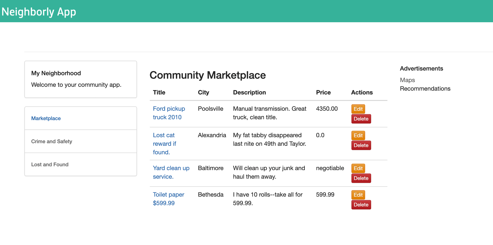

# Deploying the Neighborly App with Azure Functions

## Project Overview

For the final project of the updated Udacity Full Stack Nanodegree, an app called "Neighborly" was built and deployed. Neighborly is a Python Flask-powered web application that allows neighbors to post advertisements for services and products they can offer.

The Neighborly project is comprised of a front-end application that is built with the Python Flask micro framework. The application allows the user to view, create, edit, and delete the community advertisements.

The application makes direct requests to the back-end API endpoints. These are endpoints that we will also build for the server-side of the application.

You can see an example of the deployed app below.



## Ubuntu Environment

To keep this as simple as possible, I would HIGHLY advise building this on Ubuntu. If you need to ssh into a VM or server remember the ssh tunnel so you can check you local build. Azure will default to localhost:7071, making your login:

```bash
ssh -L [portForClient]:localhost:[portFromServer] [user]@[ip address] -p [ssh port]
```

In my case that would be:

```bash
ssh -L 3000:localhost:7071 jasen@XXX.XXX.X.XXX -p XX
```

## Getting Started

On Ubuntu 20.04 LTS, you can do this with:

```bash
# install pipenv
$ sudo apt install pipenv

# install azure-cli
$ sudo apt install azure-cli

# install azure function core tools 
$ curl https://packages.microsoft.com/keys/microsoft.asc | gpg --dearmor > microsoft.gpg
$ sudo mv microsoft.gpg /etc/apt/trusted.gpg.d/microsoft.gpg

$ sudo sh -c 'echo "deb [arch=amd64] https://packages.microsoft.com/repos/microsoft-ubuntu-$(lsb_release -cs)-prod $(lsb_release -cs) main" > /etc/apt/sources.list.d/dotnetdev.list'

$ sudo apt-get update

$ sudo apt-get install azure-functions-core-tools-4
        
# get the mongodb library
$ sudo apt install mongo-tools

# check if mongoimport lib exists
mongoimport --version
```

## Resources

Ensure terminal is running in the project folder

```bash
source variables.sh

bash resource.rh
```

the output should look like resourcesOutput.json

Copy the connection string to local.settings.json if not already there.

## Confirm import of Sample Data Into MongoDB

- Rources should import the data from the `sample_data` directory for Ads and Posts to initially fill your app.

    ```bash
    # import data from json files to the MongoDB API Collections
    $ mongoimport --uri $connectionString --d $databaseName --collection $adsCollection --file="./sample_data/sampleAds.json" --jsonArray
    $ mongoimport --uri $connectionString --d $databaseName --collection $postsCollection --file="./sample_data/samplePosts.json" --jsonArray
    ```

- Example successful import:

    ```bash
    Importing ads data ------------------->
    2020-05-18T23:30:39.018-0400  connected to: mongodb://neighborlyapp.mongo.cosmos.azure.com:10255/
    2020-05-18T23:30:40.344-0400  5 document(s) imported successfully. 0 document(s) failed to import.
    ...
    Importing posts data ------------------->
    2020-05-18T23:30:40.933-0400  connected to: mongodb://neighborlyapp.mongo.cosmos.azure.com:10255/
    2020-05-18T23:30:42.260-0400  4 document(s) imported successfully. 0 document(s) failed to import.
    ```

## Confirm connection strings

```bash
echo $connectionString
```

Expected output if deployed successfully:

If that returns nothing, reload the variable.

```bash
$ connectionString=$(az cosmosdb keys list \
    --type connection-strings \
    --name $cosmosDBAccountName \
    --resource-group $resourceGroup \
    --query 'connectionStrings[0].connectionString' \
    --output tsv) 
$ echo $connectionString
$ printf "confirm in local.settings.json or save accordingly"
```

## Update HTTP Trigger Urls

Updating the `init.py` and `function.json` for bindings to your database, respectively:

```python
url = os.environ["connectionString"] # Change the Variable name, as applicable to you
client = pymongo.MongoClient(url)
database = client['databaseName'] # Change the MongoDB name per $databaseName variable
collection = database['adsCollection']    # Change the collection name per $collectionName variable
```

## Deploy Backend/API Locally

```bash
# cd into NeighborlyAPI
cd NeighborlyAPI

# Needed only for local run
python3 -m pip install -r requirements.txt

# install dependencies
pipenv install

# go into the shell
pipenv shell

# Needed now for virtualenv
python3 -m pip install -r requirements.txt

# test func locally, build it, stay on port 7071, show me everything. 
func start --build --p 7071 --verbose

```

You may need to change `"IsEncrypted"` to `false` in `local.settings.json` if this fails.

At this point, Azure functions are hosted in localhost:7071.  You can use the browser or Postman to see if the GET request works.  For example, go to the browser and type in:

```bash
# Note: change port as applicable

# example endpoint for all advertisements
http://localhost:7071/api/getadvertisements

#example endpoint for all posts
http://localhost:7071/api/getposts
```

## Deploy Front End Locally

Leave that terminal session alone for a minute. Make another one and get to the front end folder on the device you'll host it from. You'll want to be in the Front End directory for this new terminal session.If you need to tunnel annother SSH it's good to know that flask will use port 5000.

```bash
# Needed only for local run
python3 -m pip install -r requirements.txt

# Install packages into the pipenv virtual environment and generates the Pipfile.lock with a specific set of the packages
pipenv install 

# Activate/open the virtual environment
pipenv shell

# Needed only for local run
python3 -m pip install -r requirements.txt

# Run Flask
python3 app.py
```

You can now visit Flask's localhost port and ensure that your front end loads.

## Deploy Live

Ok, shut down that backend server from `azure func` and the Flask app `python3 app.py` if you haven't already.

### For the API

```bash
func azure functionapp publish $functionApp
```

Expected output if deployed successfully:

```bash
Functions in <APP_NAME>:
    createAdvertisement - [httpTrigger]
        Invoke url: https://<APP_NAME>.azurewebsites.net/api/createadvertisement

    deleteAdvertisement - [httpTrigger]
        Invoke url: https://<APP_NAME>.azurewebsites.net/api/deleteadvertisement

    getAdvertisement - [httpTrigger]
        Invoke url: https://<APP_NAME>.azurewebsites.net/api/getadvertisement

    getAdvertisements - [httpTrigger]
        Invoke url: https://<APP_NAME>.azurewebsites.net/api/getadvertisements

    getPost - [httpTrigger]
        Invoke url: https://<APP_NAME>.azurewebsites.net/api/getpost

    getPosts - [httpTrigger]
        Invoke url: https://<APP_NAME>.azurewebsites.net/api/getposts

    updateAdvertisement - [httpTrigger]
        Invoke url: https://<APP_NAME>.azurewebsites.net/api/updateadvertisement

```

### For the Flask App

Update the connection to the live API in your settings.py

```python
API_URL="https://$functionApp.azurewebsites.net/api"
```

You'll need to do the same for the RSS feed in app.py

```python
@app.route('/rss')
def rss():
    fg = FeedGenerator()
    fg.title('Feed title')
    fg.description('Feed Description')
    fg.link(href='$functionApp.azurewebsites.net/')
```

Now it's ready

```bash
az webapp up \
    --resource-group=$resourceGroup \
    --name=$webApp \
    --runtime="python:3.7" \
    --sku=F1 \
    --location=$region
```

Expected output if deployed successfully:

```bash
{
  "URL": "http://$webApp.azurewebsites.net",
  "appserviceplan": "jasen.c7_asp_4164",
  "location": $region,
  "name": $webApp,
  "os": "Linux",
  "resourcegroup": $resourceGroup,
  "runtime_version": "python|3.9",
  "runtime_version_detected": "-",
  "sku": "FREE",
  "src_path": $workingFolder
}
```

**Note:** It may take a minute or two for the front-end to get up and running if you visit the related URL.

## CI/CD Deployment

1. Create an Azure Registry and dockerize your Azure Functions. Then, push the container to the Azure Container Registry.
2. Create a Kubernetes cluster, and verify your connection to it with `kubectl get nodes`.
3. Deploy app to Kubernetes, and check your deployment with `kubectl config get-contexts`.

### IV. Event Hubs and Logic App

1. Create a Logic App that watches for an HTTP trigger. When the HTTP request is triggered, send yourself an email notification.
2. Create a namespace for event hub in the portal. You should be able to obtain the namespace URL.
3. Add the connection string of the event hub to the Azure Function.

### V.  Cleaning Up Your Services

Before completing this step, make sure to have taken all necessary screenshots for the project! Check the rubric in the classroom to confirm.

Clean up and remove all services, or else you will incur charges.

```bash
# replace with your resource group
RESOURCE_GROUP="<YOUR-RESOURCE-GROUP>"
# run this command
az group delete --name $RESOURCE_GROUP
```
